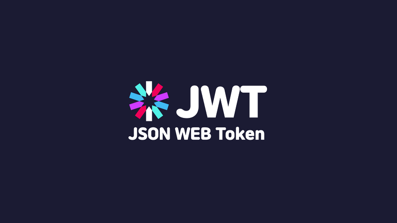

## Entertainment web app API

Entertainment web app Api is Rest Api to create user for movies web page, where user can watchor online movies.

### Table of Contents

- [Prerequisites](#Prerequisites)
- [Tech Stack](#Tech-Stack)
- [Getting Started](#Getting-Started)
- [Project Structure](#Project-Structure)

#

### Prerequisites

-  _Node JS @16.X and up_
-  _Typescript @4 and up_
-  _npm @8 and up_

#

### Tech Stack

-  _body-parser @ 1.20.0 - Node.js body parsing middleware_
-  _bcrypt @ 5.0.1 - A library to hash passwords_
-  _dotenv @ 16.0.1 - zero-dependency module that loads environment variables from a .env file_
-  _express @ 4.18.1 - web framework for node_
-  _joi @ 17.6.0 - schema description language and data validator for JavaScript_
-  _jsonwebtoken @ 8.5.1 - An implementation of JSON Web Tokens_
-  _mongodb @ 4.7.0 - document database_
-  _mongoose @ 6.4.4 - MongoDB object modeling tool_
-  _nodemailer @ 6.9.4 - email sender for node.js_
-  _swagger @ 4.4.0 - module provides tools for designing and building Swagger-compliant APIs entirely in Node.js_
-  _yaml @ 0.3.0 - yaml is a definitive library for YAML, the human friendly data serialization standard_

#

### Getting Started

1. First of all you need to clone app repository from github:

```
git clone https://github.com/tchkoidze/entertainment-web-app-api.git
```

2. Next step requires install all the dependencies.

```
npm install
```

3. Also you need to create .env file where paste information

4. To create your own database, need to create new local connection, host would be localhost.
   also you need to replace variables values in .env file, or you can generate mongo atlas url with user and password

5. Also you need to generate your own jwt secret string for protect routes authentication and save it on .env file

6. Also you need to build project in local with command:

```
npm run build:prod
```

7. And start :

npm start

#

### Project Structure

```
|--- src
|   |--- config # configuration files
|   |---|--- mongo.ts # perform mongoDb connection
|   |---|--- swagger.yaml # swagger configuration file
|   |--- controllers # functions for routes
|   |--- middlewares # extra helper middleware functions
|   |---|--- auth-middleware.js # function to protect some routes
|   |---|--- swagger-middleware.js # function to build and serve swagger
|   |--- models # mongoose models for mongoDb
|   |--- routes # project routes
|   |--- schemas # Joi validation schema files
|   |--- scripts # custom npm commands files
|   |--- server.ts # main file
- .eslintrc.json  # eslint config file
- .prettierrc.json  # prettier config file
- tsconfig.json # typescript configuration
- package.json # dependency manager configurations
```
